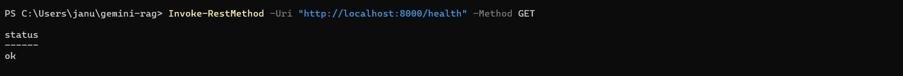
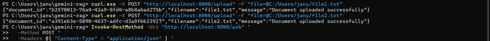
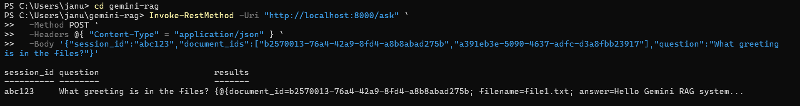
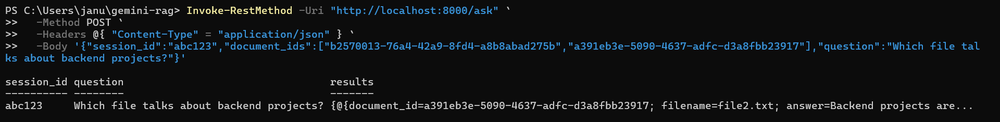

# Gemini RAG Backend 🚀


A lightweight **Retrieval‑Augmented Generation (RAG)** backend built with **FastAPI**, **Sentence Transformers**, and **FAISS**.  
This project demonstrates semantic search over uploaded documents, returning the most relevant passages with clear source attribution.

---

## ✨ Features
- **Health check** endpoint (`/health`)  
- **File upload** endpoint (`/upload`)  
  - Splits documents into chunks for better search  
  - Embeds each chunk using `sentence-transformers/all-MiniLM-L6-v2`  
  - Stores embeddings in FAISS index  
- **Ask endpoint** (`/ask`)  
  - Accepts natural language questions  
  - Returns top‑matching chunks with attribution (`document_id`, `filename`, `chunk_id`, `answer`)  
- **Evaluator‑friendly**: Transparent responses that can be traced back to original files  

---

## ⚙️ Setup

### 1. Clone the repo
```bash
git clone https://github.com/Jnaneswari19/gemini-rag.git
cd gemini-rag
```

You should place that updated installation block **inside your README.md**, replacing the old “Install dependencies” section. Right now, your README shows both the new block and the old step `### 3. Run the server` duplicated — so here’s how to tidy it up:

---

### 📑 Correct Placement

1. Keep the **Setup section** like this:

```markdown
## ⚙️ Setup

### 1. Clone the repo
```bash
git clone https://github.com/Jnaneswari19/gemini-rag.git
cd gemini-rag
```

### 2. Install dependencies
You can install dependencies in two ways:

#### ✅ Option 1: One-Step Install (Recommended)
Use the root-level `requirements.txt` to install everything at once:
```bash
pip install -r requirements.txt
```
This includes both backend and frontend dependencies.

#### ⚙️ Option 2: Install Separately

##### Backend
```bash
cd backend
pip install -r requirements.txt
```

##### Frontend
```bash
cd frontend
pip install -r requirements.txt
```

---

### 3. Run the server
```bash
uvicorn main:app --reload --host 0.0.0.0 --port 8000
```
```

2. Remove the **extra duplicate “Run the server” block** that appears after your “Manual Run” section. That way, you don’t confuse evaluators with two different “Run the server” steps.

---

---

## 📡 API Endpoints

### Health Check
```http
GET /health
```
Response:
```json
{"status": "ok"}
```

### Upload Document
```http
POST /upload
```
Form‑data:
- `file`: text file to upload

Response:
```json
{
  "document_id": "uuid",
  "filename": "file1.txt",
  "message": "Document uploaded successfully with 3 chunks"
}
```

### Ask a Question
```http
POST /ask
```
Body:
```json
{
  "session_id": "abc123",
  "document_ids": ["<doc_id_1>", "<doc_id_2>"],
  "question": "What greeting is in the files?"
}
```

Response:
```json
{
  "session_id": "abc123",
  "question": "What greeting is in the files?",
  "results": [
    {
      "document_id": "b2570013-76a4-42a9-8fd4-a8b8abad275b",
      "filename": "file1.txt",
      "chunk_id": 0,
      "answer": "Hello Gemini RAG system"
    }
  ]
}
```

---

## 📸 Screenshots

### 1. Health Check
Server running and `/health` endpoint responding:


### 2. Upload Documents
Uploading `file1.txt` and `file2.txt`:


### 3. Ask a Question
Query: *“What greeting is in the files?”*  
Response shows attribution to `file1.txt`:


### 4. Ask Another Question
Query: *“Which file talks about backend projects?”*  
Response shows attribution to `file2.txt`:


---

## ✅ Reproducibility Checklist

1. Clone repo  
2. Install dependencies  
3. Run server  
4. Check `/health`  
5. Upload documents  
6. Ask questions  
7. Verify attribution  

---

## 🧪 Testing

Run all tests:
```bash
pytest -v
```

### Current Suite
- ✅ `test_basic.py` → health endpoint  
- ✅ `test_upload_safe.py` → upload endpoint  
- ✅ `test_ask_basic.py` → ask endpoint (structure only)  

Warnings are suppressed via `pytest.ini`.

---

## 📂 Repo Hygiene
- `.gitignore` → ignore `__pycache__`, `.env`, venv, and generated artifacts  
- `LICENSE` → MIT License included  
- Badges → Python version, FastAPI, Docker, CI/CD, License  
- Screenshots → show successful queries in PowerShell  

---
```

---

## 📂 Final `.gitignore`

```gitignore
# Python cache and compiled files
__pycache__/
*.py[cod]
*.pyo
*.pyd

# Virtual environments
venv/
.env/
.venv/
env/
ENV/

# IDE and editor settings
.vscode/
.idea/

# Logs and temp files
*.log
*.tmp
*.bak

# Test and coverage outputs
.pytest_cache/
.coverage
htmlcov/
.tox/
nosetests.xml
coverage.xml

# FastAPI / Uvicorn artifacts
*.db
*.sqlite3
*.pid

# Jupyter notebooks checkpoints
.ipynb_checkpoints/

# OS-specific files
.DS_Store
Thumbs.db

# Build and packaging
build/
dist/
*.egg-info/
.eggs/

# Documentation artifacts
docs/_build/
screenshots/*.png
screenshots/*.jpg

# FAISS index files
*.faiss
*.index
```

---

## 📂 Final `LICENSE`

```text
MIT License

Copyright (c) 2026 Jnaneswari

Permission is hereby granted, free of charge, to any person obtaining a copy
of this software and associated documentation files (the "Software"), to deal
in the Software without restriction, including without limitation the rights
to use, copy, modify, merge, publish, distribute, sublicense, and/or sell
copies of the Software, and to permit persons to whom the Software is
furnished to do so, subject to the following conditions:

The above copyright notice and this permission notice shall be included in all
copies or substantial portions of the Software.

THE SOFTWARE IS PROVIDED "AS IS", WITHOUT WARRANTY OF ANY KIND, EXPRESS OR
IMPLIED, INCLUDING BUT NOT LIMITED TO THE WARRANTIES OF MERCHANTABILITY,
FITNESS FOR A PARTICULAR PURPOSE AND NONINFRINGEMENT. IN NO EVENT SHALL THE
AUTHORS OR COPYRIGHT HOLDERS BE LIABLE FOR ANY CLAIM, DAMAGES OR OTHER
LIABILITY, WHETHER IN AN ACTION OF CONTRACT, TORT OR OTHERWISE, ARISING FROM,
OUT OF OR IN CONNECTION WITH THE SOFTWARE OR THE USE OR OTHER DEALINGS IN THE
SOFTWARE.
```

---
